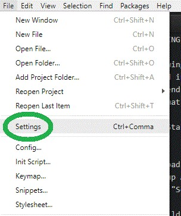
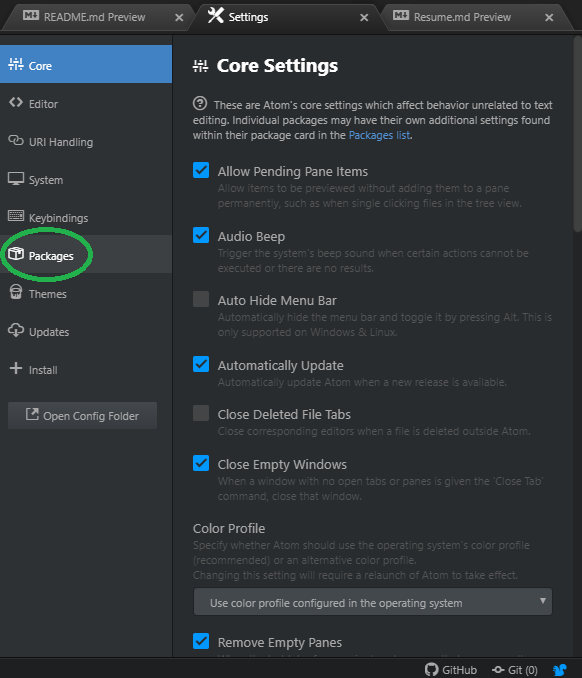
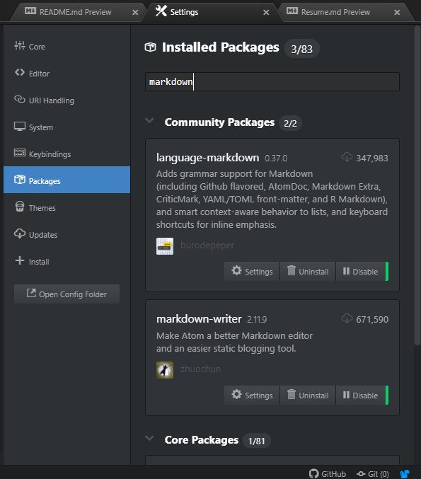
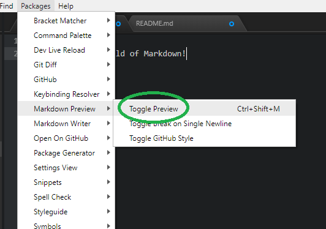
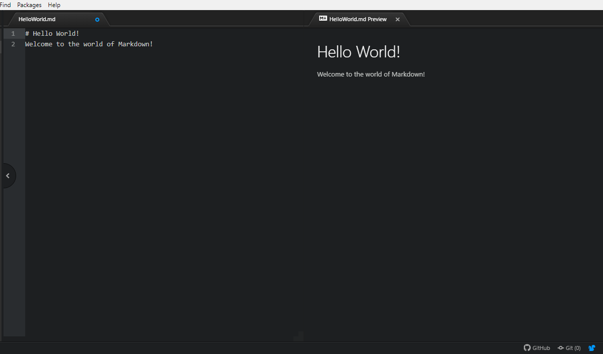

# **POSTING A RESUME IN MARKDOWN TO GITHUB**

By following this guide, you will be able to post your [resume](https://bochk44.github.io/KBochResume.github/Resume), formatted in [Markdown](https://www.markdownguide.org/), to [Github](https://github.com/). This guide is broken up into 4 parts: <a href="#first_step">Setting up Atom</a>, <a href="#second_step">Writing a Resume in Markdown</a>, <a href="#third_step">Posting it to Github</a>, and <a href="#fourth_step">Formatting it with Jekyll</a>.

---

A) <a id="first_step">Setting up Atom for Markdown</a>
---

This section is intended to help you set up the necessary tools for effectively working with Markdown. There are many other editors that you could use but this is one of the more popular and straightforward options.

  1. Download [Atom](https://atom.io/) for creating your Markdown files
  2. Open up Atom and click on the "File" tab in the top right corner
  3. Click "Settings" which should open up a new tab for Settings<br> <br>
 <br> <br> <br>
  4. Click "Packages"<br> <br>
 <br> <br> <br>
  5. Use the search bar to find and download the packages "language-markdown", "markdown-writer", and "markdown-preview" <br> <br>
 <br> <br>

  6. Ensure Atom is now fully funtional with Markdown by opening a new file titled "HelloWorld.md" (Note: all Markdown files __MUST__ end with ".md").
  7. Type the following into your file:<br>
```markdown
# Hello World!
Welcome to the world of Markdown!
```
  8. Click the "Packages" tab at the tob and find "Markdown Preview" and select "Toggle Preview" <br> <br>
 <br> <br>
  9. Verify that you are now looking at something something similar to the following screen <br> <br>
 <br> <br>

**You are now ready to begin working with Markdown!**

---
B) <a id="second_step">Writing a Resume in Markdown</a>
---

This section is intended to help guide you through building your resume. It is rather short compared to the rest as this is not truly the focus of this guide. Instead, this will simply try to give you the tools and couple helpful tips for making the conversion easier.

  1. Plan how you want your resume to look. If you have one written in another format, break it up into chunks and pick the order you want it to be read in. Otherwise, start by laying out the basics like work experience, skills, and any other info you think might be relevant.
  2. Write the basic info in the order you want and identify the main sections and headers.
  3. Using [this guide](https://github.com/adam-p/markdown-here/wiki/Markdown-Cheatsheet) adjust the formatting to fit what you believe to be important.

---
C) <a id="third_step">Posting a Markdown Page to Github</a>
---

This section is intended to help you navigate and understand how to use github for the purpose of hosting a page.

  1. Open your Github account. If you do not have one, create an account.

---
D) <a id="fouth_step">Fomatting a Markdown Page with Jekyll</a>
---

This section is intended to help you format your resume and improve on the basic Markdown appearence. Much of this will be applying a theme and ensuring that all the elements of your Markdown file appear as desired.

  1. Click on the setting tab in your repository.
