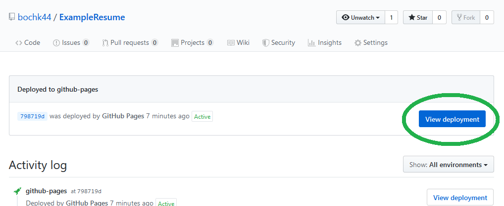

# **POSTING A RESUME IN MARKDOWN TO GITHUB**

By following this guide, you will be able to post your [resume](https://bochk44.github.io/KBochResume.github/Resume "My Resume"), formatted in [Markdown](https://www.markdownguide.org/ "Markdown Guide"), to [Github](https://github.com/ "Github Homepage"). This guide is broken up into 4 parts: <a href="#first_step">Setting up Atom</a>, <a href="#second_step">Writing a Resume in Markdown</a>, <a href="#third_step">Posting it to Github</a>, and <a href="#fourth_step">Formatting it with Jekyll</a>.

---

## A) <a id="first_step">Setting up Atom for Markdown</a>


This section is intended to help you set up the necessary tools for effectively working with Markdown. There are many other editors that you could use but this is one of the more popular and straightforward options.

  1. Download [Atom](https://atom.io/ "Download Atom") for creating your Markdown files <br> <br>
  2. Open up Atom and click on the "File" tab in the top right corner <br> <br>
  3. Click "Settings" which should open up a new tab for Settings<br> <br>
 <br> <br> <br>
  4. Click "Packages"<br> <br>
 <br> <br> <br>
  5. Use the search bar to find and download the packages "language-markdown", "markdown-writer", and "markdown-preview" <br> <br>
 <br> <br>

  6. Ensure Atom is now fully funtional with Markdown by opening a new file titled "HelloWorld.md" (Note: all Markdown files __MUST__ end with ".md").
  7. Type the following into your file:<br>
```markdown
# Hello World!
Welcome to the world of Markdown!
```
  8. Click the "Packages" tab at the tob and find "Markdown Preview" and select "Toggle Preview" <br> <br>
 <br> <br>
  9. Verify that you are now looking at something something similar to the following screen <br> <br>
 <br> <br>

**You are now ready to begin working with Markdown!**

---

## B) <a id="second_step">Writing a Resume in Markdown</a>


This section is intended to help guide you through building your resume. It is rather short compared to the rest as this is not truly the focus of this guide. Instead, this will simply try to give you the tools and couple helpful tips for making the conversion easier. <br>

  1. Plan how you want your resume to look. If you have one written in another format, break it up into chunks and pick the order you want it to be read in. Otherwise, start by laying out the basics like work experience, skills, and any other info you think might be relevant. <br> <br>
  2. Write the basic info in the order you want and identify the main sections and headers. <br> <br>
  3. Using [this guide](https://github.com/adam-p/markdown-here/wiki/Markdown-Cheatsheet "Quick Markdown Guide") adjust the formatting to fit what you believe to be important by creating headers and using line breaks to emphasize the chuncks you came up with in the last step. Try to keep it somewhat simple for now since the exact formatting may be altered when we apply Jekyll to it later. <br> <br>

---

## C) <a id="third_step">Posting a Markdown Page to Github</a>


This section is intended to help you navigate and understand how to use github for the purpose of hosting a page. <br>

  1. Open your Github account. If you do not have one, create an account. <br> <br>
  2. Create a new repository. You can do this by clicking on the plus symbol in the top right corner of your screen and selecting "New Repository" from the drop down menu. <br> <br>
  3. Fill in the details on the "Create a New Repository page". For the sake of postig your resume this means coming up with a name (which likely should be something with some part of your name and the word resume), selecting it to be public, and checking the box to initialize it with a README. Whether you want to provide a description or not is entirely up to you. <br> <br>
  4. Ensure the information is filled out correctly and click the "Create Repository" button at the bottom of the page. <br> <br>
  5. Click the "Upload Files" button just to the left of the bright green "Clone or Download" button. <br> <br>
  6. Select your resume file from your home directory to add it to your new repository. <br> <br>
  7. Open the settings for your repository. This can be found on the main page of your repository. <br> <br>
   <br> <br>
  8. Scroll down the page to find the Github Pages section and change your "Source" to being "master branch".<br> <br>
   <br> <br>
  9. Find the URL for your Github Page by returning to your settings and the Guthub Pages section. Your URL will be listed at the very top of that section (the very same one you went to in step 8). Copy the URL to your clipboard. <br> <br>
  10. Edit the README file that came pre-built into your repository (assuming you did check the box from step 3 saying you wanted a README included). Currently, your Github page will default to opening your README so you will want to include a link to your resume page in the readme using the URL you just copied and adding a slash and the name of your resume file (something like "/your_filename"). Your link should look something like this:
  ```markdown
  [Resume link](https://username.github.io/repository_name/your_filename)
  ```
  11. Click the "commit changes" button at the bottom of the page to save your changes. <br> <br>
  12. Return to the main pageo of your repository and click on the "Enviroments" tab. <br> <br>
   <br> <br>
  13. Click on the "View Deployment" button to load your page with the README file. <br> <br>
   <br> <br>
  14. Confirm that you are now looking at a page with a URL link with the name of your resume file at the end. (Note: ocassionally, Github takes several minutes to update their pages with your files so if your page doesn't load properly or as you expect it to, wait a few minutes and try again) <br> <br>
     <br> <br>
  15. Click the link to your resume and confirm that its appearance roughly matches what you saw in the Atom Markdown preview. <br> <br>
  
  

---

## D) <a id="fourth_step">Fomatting a Markdown Page with Jekyll</a>


This section is intended to help you format your resume and improve on the basic Markdown appearence. Much of this will be applying a theme and ensuring that all the elements of your Markdown file appear as desired. <br>

  1. Click on the settings tab in your repository. <br> <br>
  2. Scroll down until you reach the Github Pages section of the settings. <br> <br>
  3. Click on the "Chose a Theme" button. <br> <br>
  4. Look through the options on the top for one that looks appealing to you. <br> <br>
  5. Scroll down through the example template for the theme and ensure that any elements your resume is using are properly represented in the theme. Things such as tables don't always match the basic Markdown appearence and the theme may make them appear much different. <br> <br>
  6. Click the "Select Theme" button near the top of the page. This will add a file to your repository that will force all the markdown files in your repository to use the theme you selected. <br> <br>
  7. Edit the new file (it should end with .yml) by adding a line with `title: ` followed by whatever you want to set the title of your pages to be (this will affect both the README and the resume). You can additionally add a description below your title with a new line and adding `description: `. <br> <br>
  8. Open your page one more time through the enviroments tab (allowing time for it to update) and ensure that your resume looks the way you want it to. If it doesn't or if you changed your mind about the theme you selected, simply repeat steps 1-7 from this section until you find the best theme for you! <br> <br> <br>
  
  #### Congratulations! You now have a fully functional resume posted to Github!
